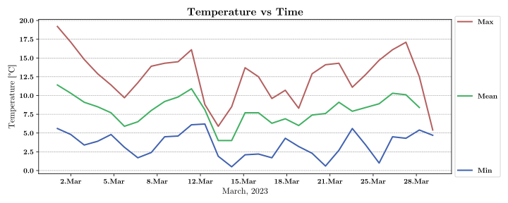
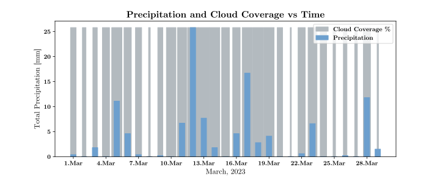
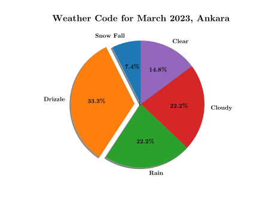
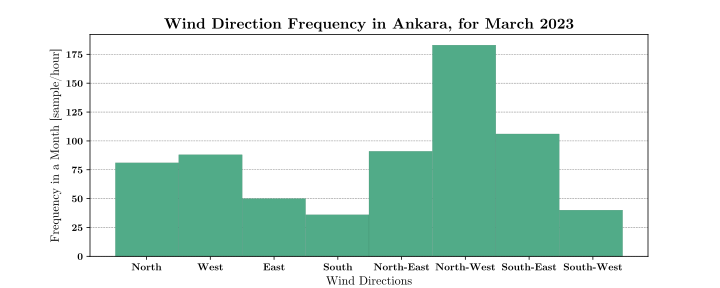
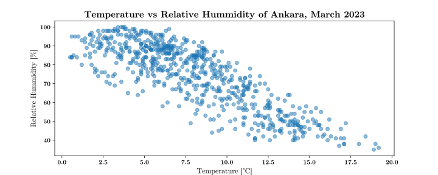
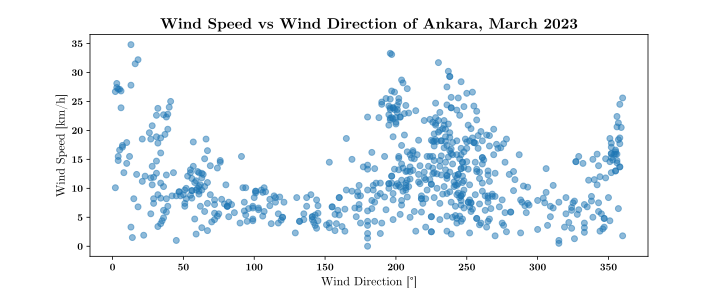
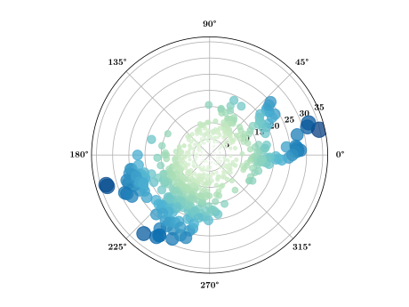

Analyze the weather data of Ankara for March, 2023.

You need to create:

- Histogram(s)
- Bar Graph(s)
- Pie Chart(s)
- Time series
- Scatter Graphs

Determine relevant:

- Mean
- Median
- Standard deviation
- Correlation factor

 ### Contents

- Time series of weather temperature for the hottest/coldest/average day of the month. [x]
- Bar graph of the precipitation and cloud coverage for the month. [x]
- Pie chart of the weathercode for the month. [x]
- Histogram of the freq vs wind direction. [x]
- Scatter graph of temperature vs hummidity sum for the month. [x]
- Bar graph of the day and night temperature for the month. [o]

** All data is from: https://open-meteo.com/en/docs/historical-weather-api

    
    
    
    
    
    
       

