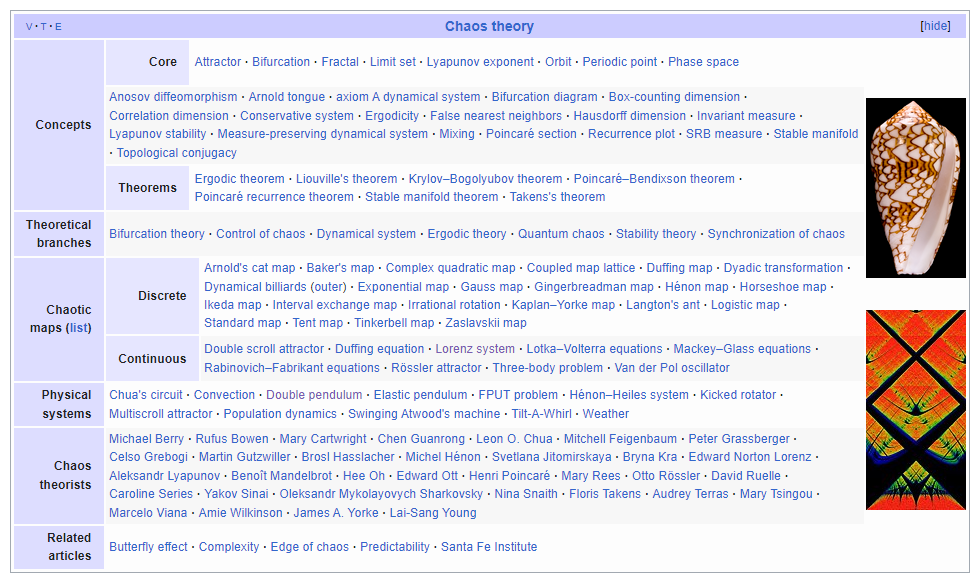

## how the things will go 
#### [thought-space for the project]
### 
----
### what is the project about
-----
### chaos theory

### thoughts

Pattern Recognition and Prediction: Machine learning algorithms can be used to recognize patterns and predict the behavior of strange attractors. Given a time series data from a strange attractor, supervised learning algorithms like recurrent neural networks (RNNs) or long short-term memory networks (LSTMs) can be trained to predict the future state of the attractor based on its past states.

Attractor Reconstruction: In some cases, we may not have access to the complete state variables of a strange attractor, but only observe one-dimensional time series data. Machine learning techniques like time delay embedding or Takens' embedding theorem can be employed to reconstruct the attractor's phase space from the observed time series data.

Dimensionality Reduction: Strange attractors often exist in high-dimensional phase spaces. Dimensionality reduction techniques, such as principal component analysis (PCA) or autoencoders, can help visualize and understand the attractor's structure in lower-dimensional spaces.

Identifying Attractor Parameters: Machine learning algorithms can be used to estimate the parameters of the chaotic equations that govern the strange attractor's behavior. By fitting the observed data to the model equations, we can infer the system's underlying dynamics.

Cluster Analysis: Machine learning clustering algorithms can be applied to identify different regimes or regions in the strange attractor's phase space. This can aid in understanding the attractor's organization and potentially uncovering new properties.

Detecting Chaos and Nonlinearity: Machine learning can also be used for detecting chaos and nonlinearity in data generated by a strange attractor. Various chaos detection algorithms can help determine whether a given system's dynamics are chaotic or not.

Controlling Chaos: Chaos control refers to manipulating the dynamics of a chaotic system to achieve a desired behavior. Machine learning algorithms can help design control strategies that stabilize or suppress chaotic behavior in strange attractors.

### papers - order of importance
- https://sprott.physics.wisc.edu/pubs/paper532.pdf

### analog implementation - future work
- http://holdenc.altervista.org/chua/
- https://en.wikipedia.org/wiki/Chua's_circuit
- https://www.youtube.com/watch?v=DFKm0K5O7ak
- https://www.youtube.com/watch?v=DBteowmSN8g

### books
* Chaos and Dynamical Systems by David Feldman
* Exploring Chaos: Theory and Experiment by Brian Davies

* Chaos: From Theory to Applications by A.A. Tsonis

* Chaos and Fractals: An Elementary Introduction by David Feldman

* Nonlinear Dynamics And Chaos by Tufillaro, Abbott, Reilly

* Computers, pattern, chaos, and beauty: Graphics from an unseen world by Clifford Pickover

* A First Course In Chaotic Dynamical Systems by Robert Devaney

### resources
- http://pystrange.jupiter-online.net/
- https://github.com/simrit1/attractors
- https://syntopia.github.io/StrangeAttractors/
- http://www.chaoscope.org/doc/attractors.htm#chaotic_flow
- https://piellardj.github.io/strange-attractors-webgl/
- http://paulbourke.net/fractals/
- http://www.3d-meier.de/tut19/Seite300.html
- https://sprott.physics.wisc.edu/PUBS.HTM
- https://sprott.physics.wisc.edu/fractals/
- http://www.3d-meier.de/tut19/Seite0.html

- https://molstar.org/

[AI SUGGESTED]
- https://www.youtube.com/watch?v=4LQvjSf6SSw
- https://en.wikipedia.org/wiki/Attractor
- https://en.wikipedia.org/wiki/Attractor#Strange_attractor
- https://en.wikipedia.org/wiki/Lorenz_system
- https://en.wikipedia.org/wiki/Chaos_theory
- https://en.wikipedia.org/wiki/Butterfly_effect
- https://en.wikipedia.org/wiki/Chaos_theory#History
- https://en.wikipedia.org/wiki/Chaos_theory#Mathematical_theories
- https://en.wikipedia.org/wiki/Chaos_theory#Applications
- https://en.wikipedia.org/wiki/Chaos_theory#In_popular_culture
- https://en.wikipedia.org/wiki/Chaos_theory#See_also
- https://en.wikipedia.org/wiki/Chaos_theory#References
- https://en.wikipedia.org/wiki/Chaos_theory#Further_reading
- https://en.wikipedia.org/wiki/Chaos_theory#External_links
- https://en.wikipedia.org/wiki/Complexity_theory_and_organizations
- https://en.wikipedia.org/wiki/Complexity_theory_and_organizations#Complexity_theory
- https://en.wikipedia.org/wiki/Complexity_theory_and_organizations#Complexity_theory_and_organizations
- https://en.wikipedia.org/wiki/Complexity_theory_and_organizations#Complexity_theory_and_management
- https://en.wikipedia.org/wiki/Complexity_theory_and_organizations#Complexity_theory_and_organizational_structure
- https://en.wikipedia.org/wiki/Complexity_theory_and_organizations#Complexity_theory_and_organizational_behavior
- https://en.wikipedia.org/wiki/Complexity_theory_and_organizations#Complexity_theory_and_organizational_learning
- https://en.wikipedia.org/wiki/Complexity_theory_and_organizations#Complexity_theory_and_organizational_communication
- https://en.wikipedia.org/wiki/Complexity_theory_and_organizations#Complexity_theory_and_organizational_culture
- https://en.wikipedia.org/wiki/Complexity_theory_and_organizations#Complexity_theory_and_organizational_development
- https://en.wikipedia.org/wiki/Complexity_theory_and_organizations#Complexity_theory_and_organizational_psychology
- https://en.wikipedia.org/wiki/Complexity_theory_and_organizations#Complexity_theory_and_organizational_ecology
- https://en.wikipedia

- https://en.wikipedia.org/wiki/Strange_attractor
- https://en.wikipedia.org/wiki/Attractor
- https://en.wikipedia.org/wiki/Attractor#Strange_attractor
- https://en.wikipedia.org/wiki/Butterfly_effect
- https://en.wikipedia.org/wiki/Chaos_theory
- https://en.wikipedia.org/wiki/Chaos_theory#Chaos_in_the_natural_sciences
- https://en.wikipedia.org/wiki/Chaos_theory#Chaos_in_the_social_sciences
- https://en.wikipedia.org/wiki/Chaos_theory#Chaos_in_the_humanities
- https://en.wikipedia.org/wiki/Chaos_theory#Chaos_in_the_social_sciences
- https://en.wikipedia.org/wiki/Chaos_theory#Chaos_in_the_humanities
- https://en.wikipedia.org/wiki/Chaos_theory#Chaos_in_the_social_sciences
- https://en.wikipedia.org/wiki/Chaos_theory#Chaos_in_the_humanities
- https://en.wikipedia.org/wiki/Chaos_theory#Chaos_in_the_social_sciences
- https://en.wikipedia.org/wiki/Chaos_theory#Chaos_in_the_humanities
- https://en.wikipedia.org/wiki/Chaos_theory#Chaos_in_the_social_sciences
- https://en.wikipedia.org/wiki/Chaos_theory#Chaos_in_the_humanities
- https://en.wikipedia.org/wiki/Chaos_theory#Chaos_in_the_social_sciences
- https://en.wikipedia.org/wiki/Chaos_theory#Chaos_in_the_humanities
- https://en.wikipedia.org/wiki/Chaos_theory#Chaos_in_the_social_sciences
- https://en.wikipedia.org/wiki/Chaos_theory#Chaos_in_the_humanities
- https://en.wikipedia.org/wiki/Chaos_theory#Chaos_in_the_social_sciences
- https://en.wikipedia.org/wiki/Chaos_theory#Chaos_in_the_humanities
- https://en.wikipedia.org/wiki/Chaos_theory#Chaos_in_the_social_sciences
- https://en.wikipedia.org/wiki/Chaos_theory#Chaos_in_the_humanities

- https://en.wikipedia.org/wiki/Chaos_theory#Chaos_in_the_social_sciences
- https://en.wikipedia.org/wiki/Chaos_theory
