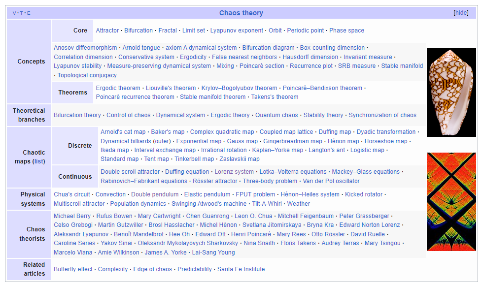

## how the things will go 
#### [thought-space for the project]
### 
----
### what is the project about
-----
### chaos theory

### resources
- https://syntopia.github.io/StrangeAttractors/
- http://www.chaoscope.org/doc/attractors.htm#chaotic_flow
- https://piellardj.github.io/strange-attractors-webgl/
- http://paulbourke.net/fractals/

- https://molstar.org/

[AI SUGGESTED]
- https://www.youtube.com/watch?v=4LQvjSf6SSw
- https://en.wikipedia.org/wiki/Attractor
- https://en.wikipedia.org/wiki/Attractor#Strange_attractor
- https://en.wikipedia.org/wiki/Lorenz_system
- https://en.wikipedia.org/wiki/Chaos_theory
- https://en.wikipedia.org/wiki/Butterfly_effect
- https://en.wikipedia.org/wiki/Chaos_theory#History
- https://en.wikipedia.org/wiki/Chaos_theory#Mathematical_theories
- https://en.wikipedia.org/wiki/Chaos_theory#Applications
- https://en.wikipedia.org/wiki/Chaos_theory#In_popular_culture
- https://en.wikipedia.org/wiki/Chaos_theory#See_also
- https://en.wikipedia.org/wiki/Chaos_theory#References
- https://en.wikipedia.org/wiki/Chaos_theory#Further_reading
- https://en.wikipedia.org/wiki/Chaos_theory#External_links
- https://en.wikipedia.org/wiki/Complexity_theory_and_organizations
- https://en.wikipedia.org/wiki/Complexity_theory_and_organizations#Complexity_theory
- https://en.wikipedia.org/wiki/Complexity_theory_and_organizations#Complexity_theory_and_organizations
- https://en.wikipedia.org/wiki/Complexity_theory_and_organizations#Complexity_theory_and_management
- https://en.wikipedia.org/wiki/Complexity_theory_and_organizations#Complexity_theory_and_organizational_structure
- https://en.wikipedia.org/wiki/Complexity_theory_and_organizations#Complexity_theory_and_organizational_behavior
- https://en.wikipedia.org/wiki/Complexity_theory_and_organizations#Complexity_theory_and_organizational_learning
- https://en.wikipedia.org/wiki/Complexity_theory_and_organizations#Complexity_theory_and_organizational_communication
- https://en.wikipedia.org/wiki/Complexity_theory_and_organizations#Complexity_theory_and_organizational_culture
- https://en.wikipedia.org/wiki/Complexity_theory_and_organizations#Complexity_theory_and_organizational_development
- https://en.wikipedia.org/wiki/Complexity_theory_and_organizations#Complexity_theory_and_organizational_psychology
- https://en.wikipedia.org/wiki/Complexity_theory_and_organizations#Complexity_theory_and_organizational_ecology
- https://en.wikipedia

- https://en.wikipedia.org/wiki/Strange_attractor
- https://en.wikipedia.org/wiki/Attractor
- https://en.wikipedia.org/wiki/Attractor#Strange_attractor
- https://en.wikipedia.org/wiki/Butterfly_effect
- https://en.wikipedia.org/wiki/Chaos_theory
- https://en.wikipedia.org/wiki/Chaos_theory#Chaos_in_the_natural_sciences
- https://en.wikipedia.org/wiki/Chaos_theory#Chaos_in_the_social_sciences
- https://en.wikipedia.org/wiki/Chaos_theory#Chaos_in_the_humanities
- https://en.wikipedia.org/wiki/Chaos_theory#Chaos_in_the_social_sciences
- https://en.wikipedia.org/wiki/Chaos_theory#Chaos_in_the_humanities
- https://en.wikipedia.org/wiki/Chaos_theory#Chaos_in_the_social_sciences
- https://en.wikipedia.org/wiki/Chaos_theory#Chaos_in_the_humanities
- https://en.wikipedia.org/wiki/Chaos_theory#Chaos_in_the_social_sciences
- https://en.wikipedia.org/wiki/Chaos_theory#Chaos_in_the_humanities
- https://en.wikipedia.org/wiki/Chaos_theory#Chaos_in_the_social_sciences
- https://en.wikipedia.org/wiki/Chaos_theory#Chaos_in_the_humanities
- https://en.wikipedia.org/wiki/Chaos_theory#Chaos_in_the_social_sciences
- https://en.wikipedia.org/wiki/Chaos_theory#Chaos_in_the_humanities
- https://en.wikipedia.org/wiki/Chaos_theory#Chaos_in_the_social_sciences
- https://en.wikipedia.org/wiki/Chaos_theory#Chaos_in_the_humanities
- https://en.wikipedia.org/wiki/Chaos_theory#Chaos_in_the_social_sciences
- https://en.wikipedia.org/wiki/Chaos_theory#Chaos_in_the_humanities
- https://en.wikipedia.org/wiki/Chaos_theory#Chaos_in_the_social_sciences
- https://en.wikipedia.org/wiki/Chaos_theory#Chaos_in_the_humanities

- https://en.wikipedia.org/wiki/Chaos_theory#Chaos_in_the_social_sciences
- https://en.wikipedia.org/wiki/Chaos_theory
